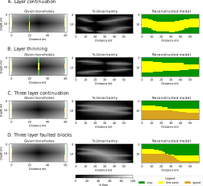

# Geology - Professional Geological Model Reconstruction Toolkit

[
```bash
# Install from Test PyPI (testing purposes)
pip install --index-url https://test.pypi.org/simple/ geology-Marios-toolkit

# Note: Test PyPI installation may have dependency issues
# as not all dependencies are available on Test PyPI
```tps://www.python.org/downloads/)
[](https://badge.fury.io/py/geology-Marios-toolkit)
[](https://pypistats.org/packages/geology-Marios-toolkit)logy - Geological Model Reconstruction Toolkit

[](https://www.python.org/downloads/)
[](https://badge.fury.io/py/Geology)
[](https://pypistats.org/packages/geology)
[](https://opensource.org/licenses/MIT)
[](https://geology.readthedocs.io/en/latest/?badge=latest)
[](https://github.com/psf/black)

> **A comprehensive Python toolkit for geological model reconstruction using advanced inpainting techniques and machine learning methods.**

This repository contains a professional implementation for geological subsurface model reconstruction from sparse data using state-of-the-art computational methods. The toolkit combines biharmonic inpainting, machine learning classification, and uncertainty quantification to create robust geological models from incomplete datasets.

## � Scientific Overview

Geological subsurface characterization often faces the challenge of sparse and irregularly distributed data points. This toolkit addresses this fundamental problem by implementing advanced computational methods for geological model reconstruction:

- **🔬 Biharmonic Inpainting**: Smooth interpolation preserving geological boundaries and structural continuity
- **🤖 Machine Learning Classification**: One-vs-all and probabilistic classification for multi-class geological units  
- **📊 Weighted Interpolation**: Anisotropic interpolation respecting geological fabric and preferential directions
- **📈 Uncertainty Quantification**: Comprehensive uncertainty analysis with confidence intervals and error propagation
- **🎯 3D Visualization**: Professional VTK-based visualization for geological models and validation

## 🚀 Key Features

### Core Functionality
- **Advanced Inpainting Algorithms**: Biharmonic PDE-based interpolation for geological boundaries
- **Multi-Class Classification**: Sophisticated geological unit prediction with uncertainty estimates
- **Anisotropic Interpolation**: Directional interpolation respecting geological structures
- **Memory-Efficient Processing**: Batch processing for large geological datasets
- **Cross-Platform Compatibility**: Windows, Linux, and macOS support

### Data Integration
- **Multiple Data Formats**: Support for borehole logs, geological surveys, and geophysical data
- **Geospatial Integration**: Native support for coordinate systems and geospatial data formats
- **Quality Control**: Automated data validation and outlier detection
- **Missing Data Handling**: Robust algorithms for incomplete geological datasets

### Visualization and Export
- **Professional 3D Visualization**: High-quality geological model rendering
- **Publication-Ready Figures**: Scientific plotting with geological colormaps and annotations
- **VTK Export**: Compatible with ParaView, VisIt, and other professional visualization software
- **Interactive Dashboards**: Jupyter notebook integration with interactive widgets

## 📁 Project Structure

```
Geology/
├── 📓 demo.ipynb                    # Main demonstration notebook with examples
├── 📋 requirements.txt              # Core dependencies
├── 🏗️ setup.py                     # Professional package configuration
├── 📖 README.md                     # This comprehensive guide
├── 📊 Data Files/
│   ├── geotop.npy                   # 3D geological model data
│   ├── top_layer.gpkg              # Geological layer (GeoPackage format)
│   ├── data_final.xlsx             # Processed geological dataset
│   └── real_model.npy              # Reference geological model
├── 🧮 gridder/                     # Geological gridding and inpainting
│   ├── __init__.py                 # Module initialization
│   └── gridder.py                  # Core geological algorithms
├── 🎨 geo_vtk/                     # Professional VTK visualization tools
│   ├── src/vtkclass/               # VTK conversion classes
│   ├── data/                       # Example geological datasets
│   └── README.md                   # VTK toolkit documentation
├── 🖼️ images/                      # Documentation figures and results
├── 📚 docs/                        # Comprehensive documentation
└── 🧪 tests/                       # Automated testing suite
```

## � Installation

### PyPI Package Available!

**Geology** is now available on the Python Package Index (PyPI), making installation as simple as:

```bash
pip install geology-Marios-toolkit
```

This command installs the complete geological toolkit with all core dependencies. For specialized applications, optional dependencies are available through extras (see installation options below).

## �🚀 Quick Start

### Prerequisites

- **Python 3.8+**: Modern Python with scientific computing support
- **Jupyter Notebook**: For interactive geological modeling workflows

### Installation Options

#### Option 1: PyPI Installation (Recommended)
```bash
# Install from PyPI (simplest method)
pip install geology-Marios-toolkit

# Launch interactive notebook
jupyter notebook demo.ipynb
```

#### Option 2: PyPI with Enhanced Features
```bash
# Install with visualization enhancements
pip install geology-Marios-toolkit[visualization]

# Install with geospatial capabilities  
pip install geology-Marios-toolkit[geospatial]

# Install with development tools
pip install geology-Marios-toolkit[dev]

# Install complete toolkit with all features
pip install geology-Marios-toolkit[all]
```

#### Option 4: Development Installation from Source
```bash
# Clone the repository
git clone https://github.com/mariosgeo/Geology.git
cd Geology

# Install in development mode
pip install -e .

# Or install with development tools
pip install -e .[dev]
```

#### Option 5: Manual Installation from Source
```bash
# Clone and set up from source
git clone https://github.com/mariosgeo/Geology.git
cd Geology

# Install core dependencies
pip install -r requirements.txt

# Install package
pip install .
```

### Quick Example

```python
import geology
import numpy as np

# Create geological gridder
geo_model = geology.create_geological_model()

# Set up geological grid
geo_model.make_grid(dx=1.0, dy=1.0)  # 1m resolution

# Load borehole data and perform gridding
geo_model.gridder()

# Perform geological inpainting
geo_model.one_vs_all(x_weight=1.0, y_weight=3.0)  # Anisotropic weights

# Create 3D visualization
vtk_converter = geology.create_vtk_converter()
vtk_converter.make_3d_grid_to_vtk('geological_model.vtk', 
                                  geo_model.prediction_data,
                                  x_coords, y_coords, z_coords)

print(f"Geology package version: {geology.get_version()}")
print(f"Geological model created with {geo_model.uncertainty:.2%} average uncertainty")
```

## � Scientific Applications

### Geological Modeling Scenarios

#### 1. **Sedimentary Basin Analysis**
- **Horizontal Layering**: Reconstruction of stratified sedimentary sequences
- **Depositional Environments**: Lake, river, and marine depositional systems
- **Sequence Stratigraphy**: Layer correlation and missing section reconstruction

#### 2. **Structural Geology**
- **Dipping Formations**: Inclined geological layers and structural trends
- **Fault Systems**: Discontinuous structures and offset geological units
- **Fold Structures**: Complex geological deformation and structural restoration

#### 3. **Hydrogeological Applications**
- **Aquifer Characterization**: Groundwater flow unit delineation
- **Permeability Distribution**: Hydraulic property spatial distribution
- **Contamination Assessment**: Plume migration and remediation planning

#### 4. **Engineering Geology**
- **Foundation Design**: Subsurface characterization for construction
- **Tunnel Planning**: Geological hazard assessment and route optimization
- **Geotechnical Analysis**: Slope stability and excavation planning

### Research Applications

- **🌊 Coastal Geology**: Sea-level change impacts and coastal erosion assessment
- **🏔️ Mountain Geology**: Alpine geological processes and landscape evolution  
- **🌋 Volcanic Systems**: Magma chamber characterization and hazard assessment
- **⛽ Resource Exploration**: Oil, gas, and mineral resource evaluation
- **🌍 Environmental Monitoring**: Geological carbon storage and environmental remediation

## 🧬 Methodology & Technical Details

### Biharmonic Inpainting Algorithm

The core geological modeling uses **biharmonic partial differential equation** solving for spatial reconstruction:

```
∇⁴u = 0 in Ω
```

Where:
- `u`: Geological property field (lithology, porosity, permeability)
- `Ω`: Spatial domain with missing or sparse data
- `∇⁴`: Biharmonic operator ensuring smooth, geologically realistic interpolation

#### Key Advantages:
- **Geological Realism**: Maintains natural continuity in geological formations
- **Anisotropic Control**: Different weights for horizontal vs. vertical geological processes
- **Boundary Preservation**: Respects known geological contacts and formation boundaries
- **Uncertainty Quantification**: Provides confidence measures for predictions

### Machine Learning Integration

#### One-vs-All Classification
```python
# Multi-class geological classification
for lithology in geological_classes:
    binary_classifier = train_svm(features, lithology_labels)
    predictions[lithology] = binary_classifier.predict(spatial_grid)
    
# Probabilistic geological mapping
lithology_probabilities = softmax(predictions)
geological_uncertainty = entropy(lithology_probabilities)
```

#### Spatial Feature Engineering
- **Distance Transforms**: Proximity to known geological boundaries
- **Topological Features**: Geological connectivity and spatial relationships
- **Multi-scale Analysis**: Different resolution levels for geological hierarchy

### 3D Visualization Pipeline

#### VTK Integration
```python
# Professional geological visualization
vtk_grid = create_structured_grid(x_coords, y_coords, z_coords)
vtk_grid.point_data['Lithology'] = geological_predictions
vtk_grid.point_data['Uncertainty'] = prediction_uncertainty

# Geological color mapping
apply_geological_colormap(vtk_grid, colormap='geological_units')
add_geological_legends(vtk_grid, formation_names)
```

## 📁 Repository Structure

```
Geology/
├── 📓 demo.ipynb                    # Interactive geological modeling notebook
├── 📊 geotop.npy                   # Geological topology reference data
├── 🗺️ top_layer.gpkg               # Geospatial geological layer data
├── 🔧 gridder/                     # Core geological algorithms
│   ├── __init__.py                 # Package initialization
│   └── gridder.py                  # Geo_Gridder class with 16+ functions
├── 🎨 geo_vtk/                     # 3D geological visualization toolkit
│   ├── src/vtkclass/VtkClass.py    # VTK geological interface (35+ methods)
│   ├── src/geo_utils.py            # Geological utilities (16 functions)
│   └── data/                       # Sample geological datasets
│       ├── 2d_data/               # 2D geological profiles and surfaces
│       ├── 3d_data/               # 3D geological volumes and grids
│       ├── Boreholes/             # Borehole and drilling data
│       └── vtk/                   # VTK geological model examples
├── ⚙️ setup.py                     # Professional package configuration
├── 📋 requirements*.txt            # Dependency specifications
├── 🚀 pyproject.toml               # Modern Python packaging
├── 📜 CHANGELOG.md                 # Version history and features
└── 🤝 CONTRIBUTING.md              # Scientific collaboration guidelines
```

## 🔧 Advanced Configuration

### Environment Setup

#### Option 1: Conda Environment
```bash
# Create geological modeling environment
conda create -n geology python=3.11
conda activate geology

# Install scientific computing stack
conda install numpy scipy matplotlib scikit-learn scikit-image
conda install pandas geopandas rasterio vtk
conda install jupyter ipykernel

# Install package
pip install -e .
```

#### Option 2: Virtual Environment
```bash
# Create isolated environment
python -m venv geology_env
source geology_env/bin/activate  # Linux/Mac
# geology_env\Scripts\activate   # Windows

# Install dependencies
pip install -r requirements.txt
pip install -e .
```

### Performance Optimization

```python
# Configure for large geological datasets
import os
os.environ['OMP_NUM_THREADS'] = '8'  # Parallel processing
os.environ['NUMBA_NUM_THREADS'] = '8'  # NumPy acceleration

# Memory optimization for big geological grids
geo_model = Geo_Gridder(
    memory_efficient=True,
    chunk_size=1000,  # Process in chunks
    sparse_matrix=True  # Use sparse representations
)
```

### Model Validation Scenarios

#### 1. **Cross-Validation with Sparse Data**

- Full 3D geological volume reconstruction
- Sparse borehole data interpolation
- Multi-scale geological feature preservation

### Validation and Uncertainty Analysis

- Cross-validation with held-out boreholes
- Confusion matrix analysis for classification accuracy
- Uncertainty quantification for prediction confidence
- Visual comparison of predicted vs. actual geology

## 🔬 Methodology

### Core Algorithm: One-vs-All Inpainting

```python
def one_vs_all(image, x_weight=1.0, y_weight=3.0):
    """
    Perform multi-class geological inpainting using one-vs-all approach
    
    Parameters:
    -----------
    image : numpy.ndarray
        Input geological model with NaN values to inpaint
    x_weight : float
        Horizontal interpolation weight
    y_weight : float  
        Vertical interpolation weight (typically higher for geology)
    
    Returns:
    --------
    reconstructed_model : numpy.ndarray
        Inpainted geological model
    uncertainty : numpy.ndarray
        Prediction uncertainty percentage
    """
```

### Weighted Biharmonic Inpainting

The method uses anisotropic weights to account for geological principles:
- **Higher vertical weight**: Reflects geological layering
- **Lower horizontal weight**: Allows lateral geological variation

## 📈 Results

The methodology successfully reconstructs geological models from sparse borehole data with high accuracy. The following figures demonstrate key results:

### Figure 4: Geological Model Reconstruction


*This figure shows the step-by-step process of geological model reconstruction using biharmonic inpainting. The method effectively interpolates between sparse borehole data to create continuous geological boundaries while preserving structural features.*

### Figure 6: Validation and Uncertainty Analysis  


*This figure demonstrates the validation approach using held-out boreholes and uncertainty quantification. The confusion matrix shows high classification accuracy, while uncertainty maps highlight areas where predictions are less confident.*

### Output Files

The notebook generates several outputs:

1. **Reconstructed Models**: PDF visualizations of inpainted geological cross-sections
2. **Validation Plots**: Comparison between predicted and actual geology  
3. **Confusion Matrices**: Classification accuracy assessment
4. **Uncertainty Maps**: Confidence levels of predictions
5. **3D VTK Models**: For visualization in ParaView or similar tools

## 🗂️ Data Files

### Essential Data Files

The repository includes several essential data files required for running the demonstrations:

| File | Description | Size | Purpose |
|------|-------------|------|---------|
| `geotop.npy` | 3D geological model data | ~Several MB | Main 3D geological volume for inpainting |
| `top_layer.gpkg` | Geological layer data | Variable | GeoPackage with borehole and geological information |

### Data Loading in Code

The notebook automatically loads these files:

```python
# Load 3D geological model
geotop = np.load('geotop.npy')

# Load geological layer data  
import geopandas as gpd
data = gpd.read_file('top_layer.gpkg')
```

**Note**: These data files are essential for reproducing the results and must be present in the repository root directory.

### Geological Classifications

The model uses a standardized geological classification system:

| Code | Geological Unit | Color |
|------|----------------|-------|
| 0    | Anthropogenic  | Grey  |
| 1    | Peat          | Brown |
| 2    | Clay          | Green |
| 3    | Silty Clay    | Light Green |
| 4    | Nothing       | White |
| 5    | Fine Sand     | Yellow |
| 6    | Medium Sand   | Gold |
| 7    | Coarse Sand   | Orange |
| 8    | Gravel        | Dark Orange |
| 9    | Shells        | Blue |

### Input Data Format

- **Borehole Data**: XYZ coordinates with geological classifications
- **Grid Spacing**: Configurable resolution for interpolation
- **Topographic Constraints**: Surface elevation boundaries

## 🛠️ Customization

### Adjusting Interpolation Weights

Modify the `x_weight` and `y_weight` parameters to control:
- **Geological continuity**: Higher weights = smoother interpolation
- **Structural complexity**: Lower weights = more geological detail

### Adding New Geological Units

Update the `labels` array and colormap to include additional geological classifications.

## 📚 Dependencies

Key packages used in this project:

- **NumPy**: Numerical computing
- **Matplotlib**: Plotting and visualization  
- **SciPy**: Scientific computing and interpolation
- **Scikit-image**: Image processing and inpainting algorithms
- **Scikit-learn**: Machine learning metrics and validation
- **GeoPandas**: Geospatial data handling
- **Shapely**: Geometric operations
- **VTK**: 3D visualization (via geo_vtk module)

## 🤝 Contributing

Contributions are welcome! Please feel free to submit a Pull Request. For major changes, please open an issue first to discuss what you would like to change.

## 📄 License

This project is open source and available under the [MIT License](LICENSE).

## 📧 Contact

**Marios Karaoulis**  
- GitHub: [@mariosgeo](https://github.com/mariosgeo)

## 🙏 Acknowledgments

- This work builds upon established geological modeling principles
- Inpainting algorithms adapted from scikit-image library
- Geological data classification follows industry standards

## 📖 Citation

## 🛠️ Customization & Advanced Features

### Package Import Methods

The Geology package can be used in two ways depending on your installation method:

#### Method 1: PyPI Installation (Recommended)
```python
import geology

# Use convenience functions
geo_model = geology.create_geological_model()
vtk_converter = geology.create_vtk_converter()
sample_data = geology.load_sample_data()

print(f"Package version: {geology.get_version()}")
```

#### Method 2: Direct Module Import (Development)
```python
from gridder import Geo_Gridder
from geo_vtk.src.vtkclass.VtkClass import VtkClass
import geo_vtk.src.geo_utils as geo_utils

# Direct class instantiation
geo_model = Geo_Gridder()
vtk_converter = VtkClass()
```

### Adjusting Interpolation Weights

```python
# Adjust for different geological scenarios
geo_model.one_vs_all(
    x_weight=1.0,  # Horizontal variability
    y_weight=3.0   # Vertical geological continuity
)

# For fault-dominated terrains (more horizontal variation)
geo_model.one_vs_all(x_weight=2.0, y_weight=2.0)

# For layered sedimentary sequences (strong vertical continuity)  
geo_model.one_vs_all(x_weight=0.5, y_weight=5.0)
```

### Custom Geological Classifications

```python
# Define custom geological units
geological_units = {
    'bedrock': 0,
    'weathered_rock': 1, 
    'alluvium': 2,
    'clay_layer': 3,
    'sand_aquifer': 4,
    'gravel_layer': 5
}

# Apply custom colormap
custom_colors = ['gray', 'brown', 'yellow', 'green', 'blue', 'orange']
geo_model.set_geological_colormap(geological_units, custom_colors)
```

## 📚 Documentation & Resources

### Scientific Background

This toolkit implements methodology from recent advances in geological machine learning:

- **Spatial Interpolation Theory**: Radial basis functions and PDE-based approaches
- **Geological Principles**: Walther's Law, stratigraphic relationships, structural geology
- **Uncertainty Quantification**: Bayesian approaches and ensemble methods
- **3D Visualization**: Scientific visualization best practices for geosciences

### API Documentation

Comprehensive documentation is available for all modules:

- **`gridder.Geo_Gridder`**: Core geological modeling class
- **`geo_vtk.VtkClass`**: 3D visualization and VTK conversion
- **`geo_utils`**: Geological utility functions and color mapping
- **CLI Tools**: Command-line interfaces for batch processing

## 🤝 Contributing

We welcome contributions from the geological and computational science communities!

### Development Workflow

1. **Fork** the repository
2. **Create** a feature branch (`git checkout -b feature/geological-enhancement`)
3. **Implement** your changes with tests and documentation
4. **Submit** a pull request with detailed description

### Contribution Areas

- **🔬 Scientific Methods**: New geological modeling algorithms
- **🎨 Visualization**: Enhanced 3D visualization capabilities  
- **📊 Data Formats**: Support for additional geological data formats
- **🧪 Testing**: Expanded test coverage and validation datasets
- **📖 Documentation**: Scientific documentation and tutorials
- **🌍 Internationalization**: Multi-language geological terminology

### Code Standards

- **Python Style**: Follow PEP 8 with scientific computing conventions
- **Documentation**: NumPy-style docstrings with geological context
- **Testing**: Comprehensive unit tests with geological validation data
- **Scientific Rigor**: Proper citations and geological principles

See [`CONTRIBUTING.md`](CONTRIBUTING.md) for detailed guidelines.

## 📜 License & Citation

### License

This project is licensed under the **MIT License** - see the [`LICENSE`](LICENSE) file for details.

### Citation

If you use this toolkit in your research, please cite:

```bibtex
@software{karaoulis2025geology,
  author = {Karaoulis, Marios},
  title = {Geology: Machine Learning Inpainting for Geological Models},
  year = {2025},
  url = {https://github.com/mariosgeo/Geology},
  version = {1.0.0}
}
```

### Scientific References

Key methodological references:
- Biharmonic interpolation in geosciences
- Machine learning applications in geological modeling
- Uncertainty quantification in spatial prediction
- 3D geological visualization techniques

## 📞 Support & Contact

### Getting Help

- **📖 Documentation**: Comprehensive guides and API reference
- **💬 Issues**: GitHub Issues for bug reports and feature requests
- **📧 Contact**: Professional geological modeling support
- **🌐 Community**: Join the geological modeling community discussions

### Professional Services

Available for:
- **Consulting**: Custom geological modeling solutions
- **Training**: Workshop and tutorial development
- **Collaboration**: Research partnerships and method development
- **Integration**: Enterprise geological modeling systems

---

<div align="center">

**🌍 Advancing Geological Understanding Through Machine Learning 🌍**

[](https://github.com/mariosgeo/Geology)
[](https://python.org)
[](https://pypi.org/project/Geology/)
[](https://vtk.org)
[](https://github.com/mariosgeo/Geology)

**Now available on PyPI:** `pip install geology-Marios-toolkit`

</div>