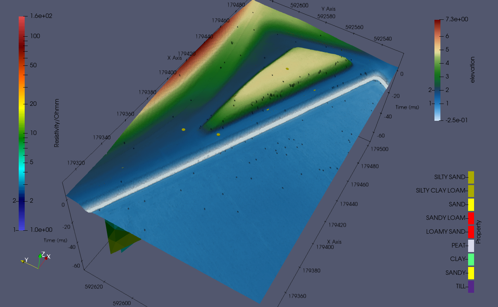
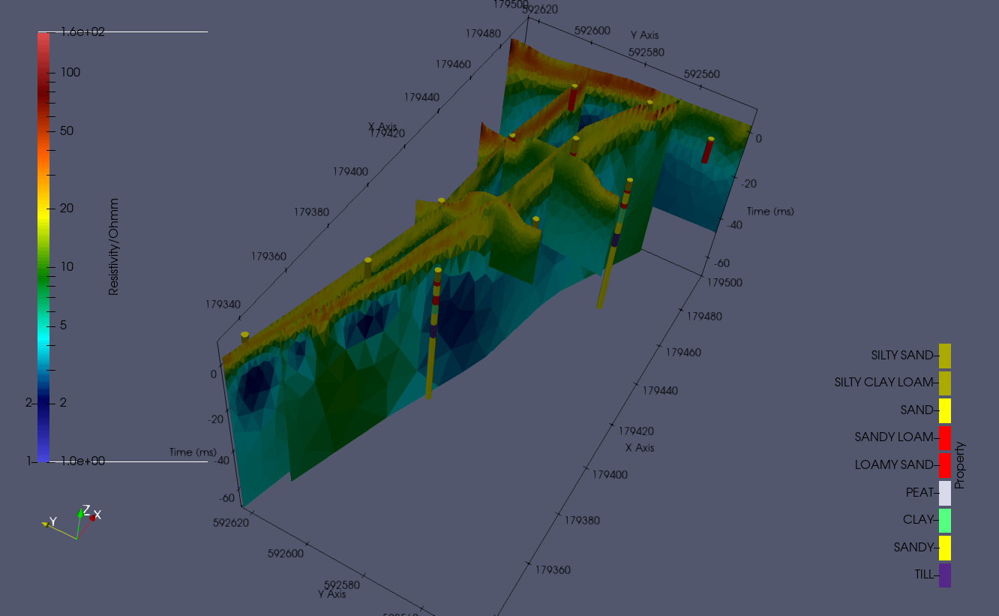
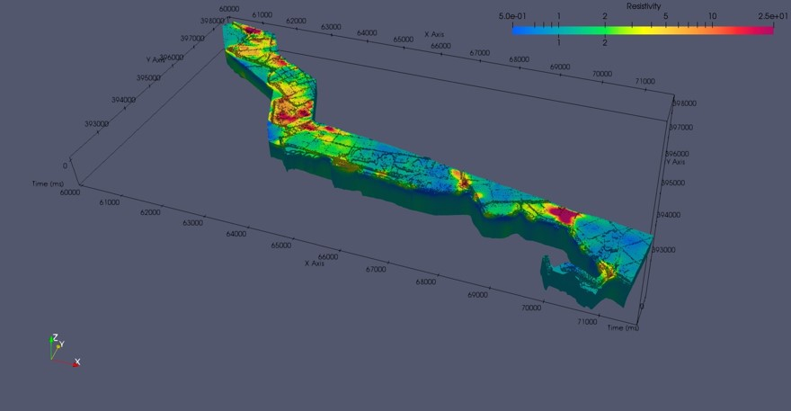
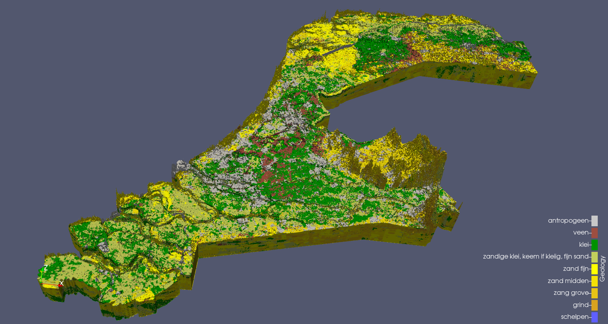

# Visualizing geological and geophysical data in VTK


This is a a toolbox that exports your geological data to VTK.
Follow the examples in the src directory.


## See an example
<p align='center'>  
  
</p>


<p align='center'>  
  
</p>

<p align='center'>  
  
</p>


<p align='center'>  
<a href="https://www.youtube.com/embed/WlT2Gzvk-2I
" target="_blank"></a>
</p>

## Prerequisites
numpy<br><br>
pandas<br><br>
gdal


## Installation
Installation can be found: 


## Usage:

- 1D boreholes
```
int1.vtkclass()
# test

```

- 2d cross setion
  - Same example


## Citation
```
@inproceedings{test1,
   author    = {test2},
   title     = {test3},
   booktitle = {arXiv preprint arXiv:zzzz.zzzzz},   
   year      = {20zz},
}

```

Contact: Marios Karaoulis (marios.karaoulis@outlook.com)

## Acknowledgments
We thank me for the moment :).